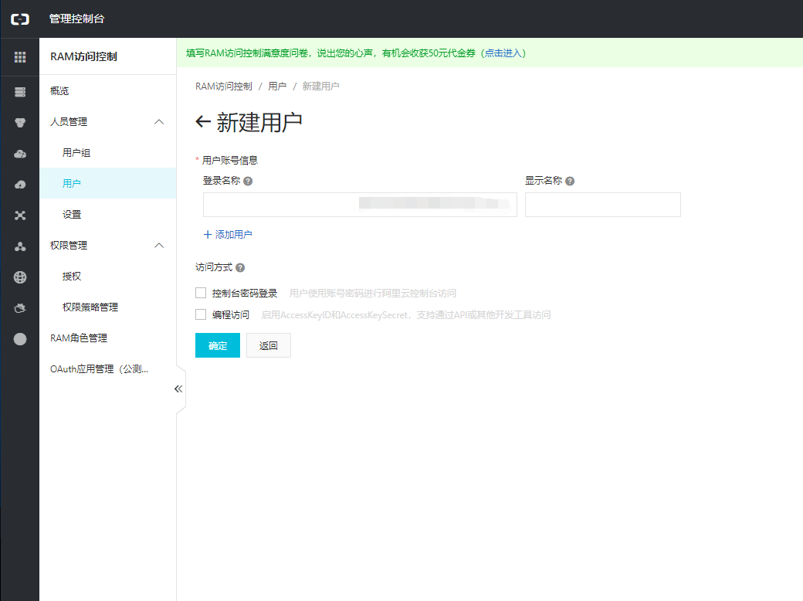
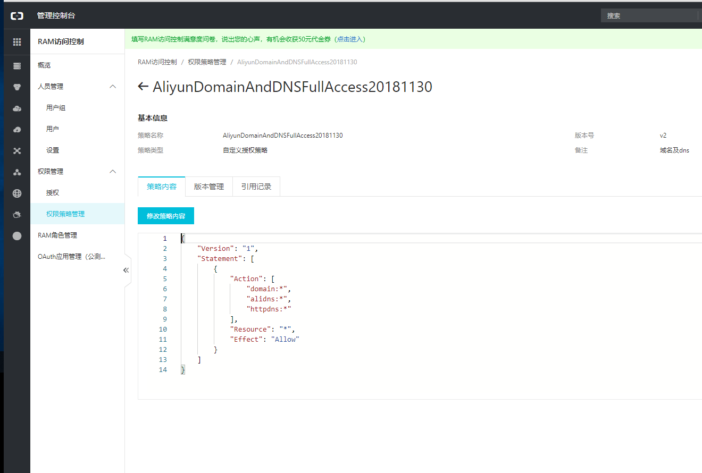
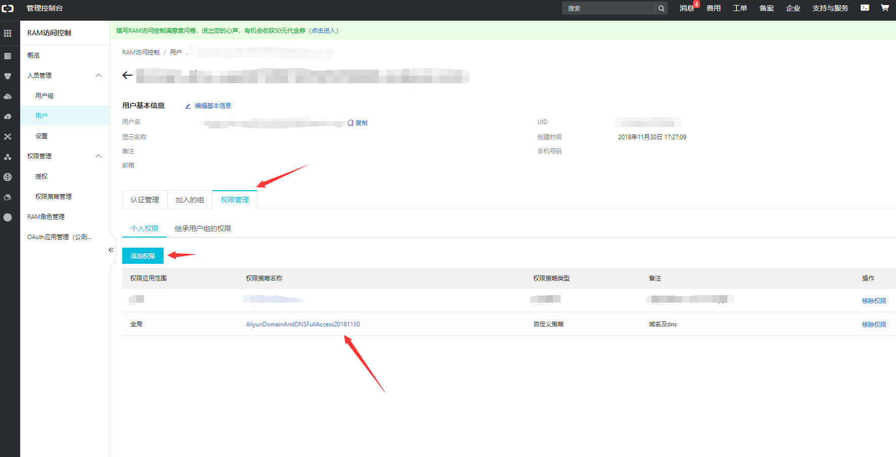
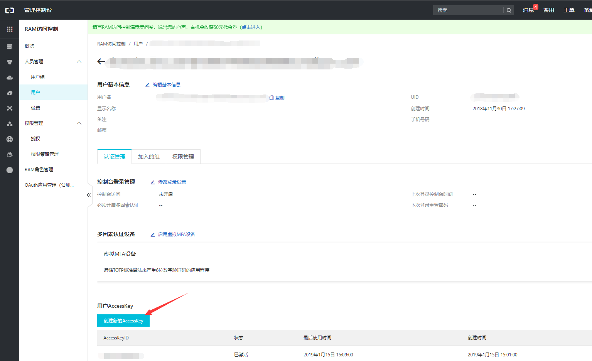

[Let's Encrypt](https://letsencrypt.org/) 支持了[通配符域名证书](https://community.letsencrypt.org/t/acme-v2-and-wildcard-certificate-support-is-live/55579/)之后，就更没有理由不给自己的站点加上那把锁啦，so let's encrpyt!🔒。

虽然certbot已经很方便了，但是我们有更方便的[acme.sh](https://acme.sh/)，我的域名是在阿里买的，配合阿里的 DNS API，可以全自动地生成证书，而不用手动添加txt验证。

1. **获取阿里accessKey**  
首先去阿里RAM控制台新建用户  
  
然后创建并赋予修改DNS记录的权限  
  
  
最后获得我要需要使用的API Key   
   

2. **安装`acme.sh`**  
执行命令：
```bash
curl  https://get.acme.sh | sh
```  
默认会安装到`~/.acme.sh/`这个目录下，后面自动生成的acme.sh配置和域名证书也会在这个目录。  
安装命令会自动创建一个 alias ，重新登陆就可使用这个alias。 
```bash
alias acme.sh=~/.acme.sh/acme.sh
```

3. **生成证书**  
设置DNS API Key&Secret:
```bash
export Ali_Key="*******"
export Ali_Secret="*******"
```
之后就可以签发证书了
```bash
acme.sh --issue --dns dns_ali -d example.com -d *.example.com 
```
等待一会，证书就生成好了，可以前往`~/.acme.sh/`查看。之前设置的 DNS API Key&Secret 也会保存到`~/.acme.sh/account.conf`。

以上就是生成通配符域名证书的全过程，acme.sh会自动为你创建 cronjob, 在每天 0:00 点自动检测所有的证书, 如果需要更新, 则会根据现有配置自动更新证书。

