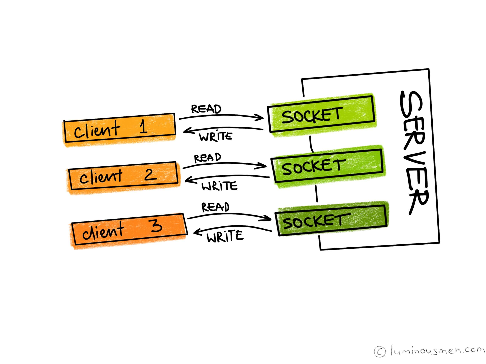

本文为翻译作品 [点击原文](https://luminousmen.com/post/asynchronous-programming-blocking-and-non-blocking)


这是关于异步编程的系列文章的第一篇文章。整个系列试图带你回答一个简单的问题：“什么是异步？”。

当我最初深入探索这个问题的时候 - 我以为我知道什么是异步了。事实证明我还是找不到打开异步大门的钥匙。接下来，就让我们一起寻找吧！

全系列: 
* [Asynchronous programming. Blocking I/O and non-blocking I/O](https://luminousmen.com/post/asynchronous-programming-blocking-and-non-blocking)
* [Asynchronous programming. Cooperative multitasking](https://luminousmen.com/post/asynchronous-programming-cooperative-multitasking)
* [Asynchronous programming. Await the Future](https://luminousmen.com/post/asynchronous-programming-await-the-future)
* [Asynchronous programming. Python3.5+](https://luminousmen.com/post/asynchronous-programming-python3.5)

在这篇文章中，我们将会讨论网络，不过您只需要将其映射为一种输入/输出(I/O)操作就可以了，举个例子🌰，将 ```Sockets``` 映射为文件描述符。本篇文章不限定任何编程语言，尽管示例将使用 Python（没办法 - 谁让我这么喜欢 Python 呢）
- - -

在客户端 - 服务器应用程序中，当客户端向服务器发出请求时，服务器处理请求并发回响应。在这个场景中，客户端和服务器首先需要建立彼此的连接，这就是套接字(Sockets)发挥作用的地方。
客户端和服务器最后都必须将自己绑定到相应的套接字上，服务器开始监听其套接字以便客户端发送请求。


如果你看一下处理器速度和网络连接的比例，您将看到差异是两个数量级。如果我们的应用程序使用 I/O，那么 CPU 在大多数情况下都不会执行任何操作，这种类型的应用程序称为 I/O 密集型。对于需要高性能的应用程序，这是一个主要的瓶颈，因为其他活动和其他 I/O 操作都需要等待 - 事实证明这些系统都是懒散的。

I/O 形式有3种可能：**阻塞**，**非阻塞**和**异步**。最后一个不适用于网络，因此，我们有两个选项 - 阻止和非阻塞。

## Blocking I/O (阻塞 I/O) ##

考虑这种情况，在UNIX（POSIX）BSD套接字的例子中（在Windows中一样 - 调用不同，但逻辑相同）。

使用阻塞 I/O，当客户端发出连接到服务器的请求时，处理该连接的 Socket 被阻塞，直到有一些数据要读取或数据被完全写入。在操作完成之前，服务器除了等待之外什么也做不了。由此得出最简单的结论：在单个执行线程中，我们不能提供多个连接。默认情况下，TCP套接字处于阻塞模式。

简单的 Python 例子， 客户端: 
```python
import socket

sock = socket.socket()

host = socket.gethostname()
sock.connect((host, 12345))

data = b"Foo Bar" *10*1024 # Send a lot of data to be sent
assert sock.send(data) # Send data till true
print("Data sent")
```

服务器端:
```python
import socket

s = socket.socket()

host = socket.gethostname()
port = 12345

s.bind((host, port))
s.listen(5)

while True:
	conn, addr = s.accept()
	data = conn.recv(1024)	
	while data:
		print(data)
		data = conn.recv(1024)
	print("Data Received")
	conn.close()
	break
```
您会注意到服务器继续打印我们的空消息串`""`。一直持续到所有数据都被发送。在上面的代码中，`"Data Received"` 消息将不会打印，因为客户端必须花费时间发送大量数据，直到 Socket **被阻塞**。

这里发生了什么？ `send()` 方法尝试将所有数据传输到服务器，而客户端上的写缓冲区将持续获取数据。 当缓冲区变空时，内核将再次唤醒进程以获取要传输的下一个数据块。 简而言之，您的代码将被阻止，并且不会让任何其他内容继续进行。

在这种情况下，我们需要多个线程来实现[并发](https://luminousmen.com/post/concurrency-and-parallelism-are-different)请求，我们需要有多个线程，即我们需要为每个客户端连接分配一个新线程。我们将在稍后讨论这个问题。

## Non-Blocking I/O (非阻塞 I/O) ##

但还有第二种选择 - 非阻塞I/O。从字面意思来看，差异是显而易见的 —— 从客户端角度来看，任何操作都会立即完成，而不是阻塞。非阻塞I/O意味着请求立即入队等待，本次函数调用结束。然后在稍后的某个时刻处理刚才入队的I/O。

回到我们的示例，我们在客户端进行一些更改：
```python
import socket

sock = socket.socket()

host = socket.gethostname()
sock.connect((host, 12345))
sock.setblocking(0) # Now setting to non-blocking mode

data = b"Foo Bar" *10*1024
assert sock.send(data)
print("Data sent")
```
现在，如果我们运行这段代码，你会注意到程序将运行一小段时间，然后打印 `"Data sent"` 并终止。

这里又发生了什么呢？ 这里客户端没有发送所有数据。 当我们通过调用 `setblocking(0)` 创建一个非阻塞 socket 时，它将永远不会等待操作完成。因此，当我们调用 `send()` 方法时，它会尽可能多地将数据放入缓冲区并直接返回。

使用这种模式，我们可以同时在一个线程中对不同的 socket 执行多个 I/O 操作。但是，由于不知道 socket 是否已准备好进行 I/O 操作，我们必须不断地访问每个 socket，这样，就产生了一个无限循环。

为了摆脱这种效率低下的循环，需要一种**轮询准备就绪机制**，让我们可以轮询所有 socket 的准备情况，并告诉我们哪些 socket 已准备好进行新的 I/O 操作。 当任何 socket 准备就绪时，我们将执行入队操作，之后我们可以返回阻塞状态，等待再次为下一个 I/O 操作做好准备的 socket。

轮询准备就绪的实现有几种机制，它们在性能和细节方面各有不同，但通常情况下，细节隐藏在“引擎盖下”，对使用者来说是不可见的。

### Keywords to search (关键词搜索): ###

Notifications:

* Level Triggering (state)
* Edge Triggering (state changed)

Mechanics:

* `select()`, `poll()`
* `epoll()`, `kqueue()`
* EAGAIN, EWOULDBLOCK

## Multitasking (多任务) ##

我们的目标是同时管理多个客户端。我们如何确保同时处理多个请求？

有几种选择:

## Separate processes (独立进程) ##



最简单和历史上第一种方法是在单独的进程中处理每个请求。这很好，因为我们可以使用相同的阻塞 I/O API。 如果进程突然崩溃，它只会影响在这个特定进程中处理的操作，而不会影响其他任何进程。

减分项 - 沟通困难。 在形式上，进程之间几乎没有任何共同点，我们想要组织的任何重要的通信都需要额外的努力来同步访问等。此外，在任意时间点，可能会有多个进程只是等待客户端请求， 这是资源浪费。

****未完待续****