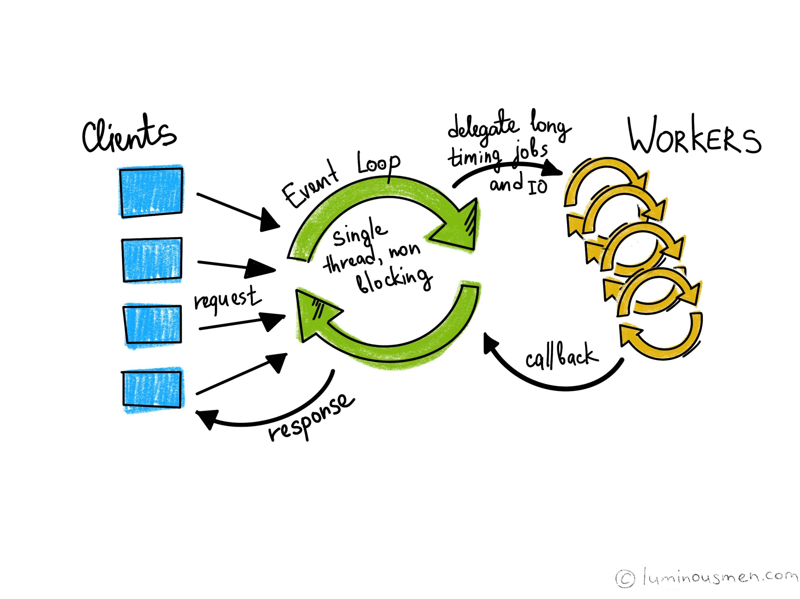
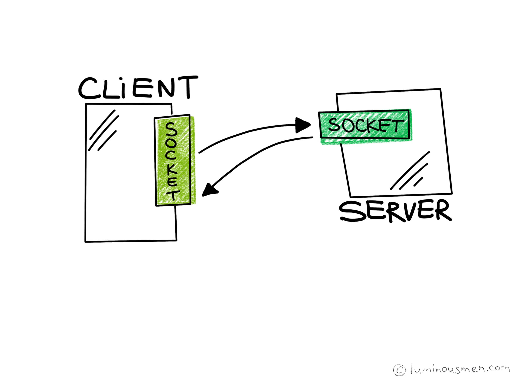

本文为翻译作品 [点击原文](https://luminousmen.com/post/asynchronous-programming-blocking-and-non-blocking)



这是关于异步编程的系列文章的第一篇文章。整个系列试图带你回答一个简单的问题：“什么是异步？”。

当我最初深入探索这个问题的时候 - 我以为我知道什么是异步了。事实证明我还是找不到打开异步大门的钥匙。接下来，就让我们一起寻找吧！

全系列: 
* [Asynchronous programming. Blocking I/O and non-blocking I/O](https://luminousmen.com/post/asynchronous-programming-blocking-and-non-blocking)
* [Asynchronous programming. Cooperative multitasking](https://luminousmen.com/post/asynchronous-programming-cooperative-multitasking)
* [Asynchronous programming. Await the Future](https://luminousmen.com/post/asynchronous-programming-await-the-future)
* [Asynchronous programming. Python3.5+](https://luminousmen.com/post/asynchronous-programming-python3.5)

在这篇文章中，我们将会讨论网络，不过您只需要将其映射为一种输入/输出(I/O)操作就可以了，举个例子🌰，将 ```Sockets``` 映射为文件描述符。本篇文章不限定任何编程语言，尽管示例将使用 Python（没办法 - 谁让我这么喜欢 Python 呢）
- - -

在客户端 - 服务器应用程序中，当客户端向服务器发出请求时，服务器处理请求并发回响应。在这个场景中，客户端和服务器首先需要建立彼此的连接，这就是套接字(Sockets)发挥作用的地方。
客户端和服务器最后都必须将自己绑定到相应的套接字上，服务器开始监听其套接字以便客户端发送请求。



如果你看一下处理器速度和网络连接的比例，您将看到差异是两个数量级。如果我们的应用程序使用 I/O，那么 CPU 在大多数情况下都不会执行任何操作，这种类型的应用程序称为 I/O 密集型。对于需要高性能的应用程序，这是一个主要的瓶颈，因为其他活动和其他 I/O 操作都需要等待 - 事实证明这些系统都是懒散的。

I/O 形式有3种可能：**阻塞**，**非阻塞**和**异步**。最后一个不适用于网络，因此，我们有两个选项 - 阻止和非阻塞。

## Blocking I/O ##

考虑这种情况, 在UNIX（POSIX）BSD套接字的例子中（在Windows中一样 - 调用不同，但逻辑相同）。

使用阻塞 I/O，当客户端发出连接到服务器的请求时，处理该连接的 Socket 被阻塞，直到有一些数据要读取或数据被完全写入。在操作完成之前，服务器除了等待之外什么也做不了。由此得出最简单的结论：在单个执行线程中，我们不能提供多个连接。默认情况下，TCP套接字处于阻塞模式。

简单的 Python 例子， 客户端: 
```python
import socket

sock = socket.socket()

host = socket.gethostname()
sock.connect((host, 12345))

data = b"Foo Bar" *10*1024 # Send a lot of data to be sent
assert sock.send(data) # Send data till true
print("Data sent")
```

服务器端:
```python
import socket

s = socket.socket()

host = socket.gethostname()
port = 12345

s.bind((host, port))
s.listen(5)

while True:
	conn, addr = s.accept()
	data = conn.recv(1024)	
	while data:
		print(data)
		data = conn.recv(1024)
	print("Data Received")
	conn.close()
	break
```
您会注意到服务器继续打印我们的空消息串`""`。一直持续到所有数据都被发送。在上面的代码中，`"Data Received"`消息将不会打印，因为客户端必须花费时间发送大量数据，直到 Socket **被阻塞**。


****未完待续****