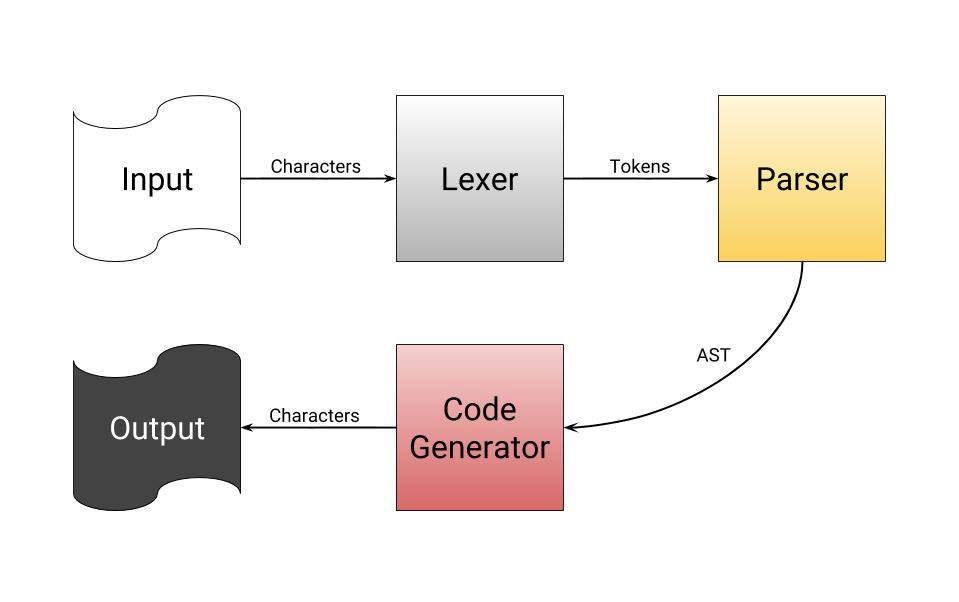
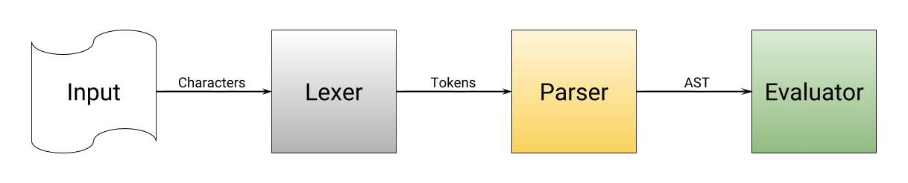
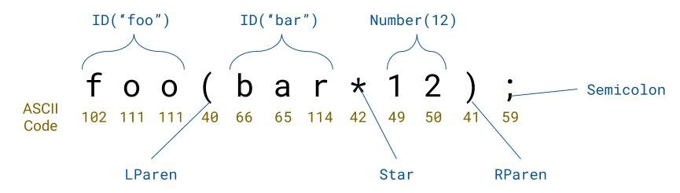

本文为翻译作品 [点击原文](https://towardsdatascience.com/understanding-compilers-for-humans-version-2-157f0edb02dd)

理解编译器的内部运作原理可以让你更高效地使用它。在接下来的一系列文章中，我将使用包含大量引用链接、示例代码和图示的组合来帮助你理解编程语言和编译器是如何工作的。

- - -

作者笔记  
[理解编译器 - 人类视角(Version 2)](https://blog.leble.ink/understanding-compilers-for-humans-version-2/) 是我在Medium发布的第二篇文章的后续更新，这篇文章有超过2万多浏览量，我非常高兴能够在传授知识上做出一点微小积极的贡献，我也非常兴奋能够基于那篇文章的评论带来完全重构的新文章。


我选择 Rust 作为这个系列文章的主要语言。它是一门详细、高效、现代的，并且在设计上似乎对制作编写器非常简单。我喜欢用它。[https://www.rust-lang.org/](https://www.rust-lang.org/)


这篇文章的目的是引起读者关于编译器的兴趣，而不是超过20页的长篇累牍。这篇文章中有许多链接可以指导您更深入地了解引起您兴趣的主题。大多数链接都指向维基百科。

请随时在底部的评论部分留下任何问题或建议。感谢您的关注，我希望您喜欢。

- - -

## 介绍
### 什么是编译器

**一般来说，你可以称之为编程语言的只是软件，称为编译器，它读取文本文件，对其进行大量处理并生成二进制文件。**由于计算机只能读取1和0，并且人类编写的Rust比二进制文件更好，因此编译器会将人类可读的文本转换为计算机可读的机器代码。
```rust
// An example compiler that turns 0s into 1s, and 1s into 0s.
 
fn main() {
    let input = "1 0 1 A 1 0 1 3";
    
    // iterate over every character `c` in input
    let output: String = input.chars().map(|c|
        if c == '1' { '0' }
        else if c == '0' { '1' }
        else { c } // if not 0 or 1, leave it alone
    ).collect();
    
    println!("{}", output); // 0 1 0 A 0 1 0 3
}
```
*虽然上面这个编译器不读取文件，不生成AST，也不生成二进制文件，但它仍然被认为是编译器，原因很简单，它转换了一个输入输出。*

### 编译器的工作流程

简单来说，编译器读取源代码并生成二进制文件。人类可读的代码直接转换为0和1是非常复杂的，从主要的来讲，编译器在程序可运行之前有几个处理步骤：
1. 读取您提供的源代码的各个字符。
2. 将字符排序为单词，数字，符号和运算符。
3. 获取已排序的字符并通过将它们与模式匹配并创建操作树来确定它们尝试执行的操作。
4. 迭代在最后一步中生成的树中的每个操作，并生成等效的二进制文件。

*虽然我说编译器立即从一个操作树转到二进制，但它实际上是生成汇编代码，然后汇编/编译成二进制代码。汇编就像一个更高级别，人类可读的二进制文件。详细了解[点击这里](https://en.wikipedia.org/wiki/Assembly_language)。*



### 什么是解释器
[解释器(Interpreter)](https://en.wikipedia.org/wiki/Interpreter_%28computing%29) 很像编译器，因为他们读取一种语言并对其进行处理。但是，**解释器会跳过代码生成并执行[即时编译(JIT)](https://en.wikipedia.org/wiki/Just-in-time_compilation)AST。**解释器的最大优点是在调试期间开始运行程序所需的时间可以变得很小。编译器可能需要花费几秒到几分钟的时间来在执行编译阶段，而解释器可以立即开始执行，而不进行编译。解释器的最大缺点是它需要在执行程序之前安装在用户的计算机上。


本文主要涉及的是编译器，但也应明确它们之间的差异以及编译器之间的关系，对比上面两图可以看见解释器缺少最后一个步骤：生成二进制执行文件，而直接执行程序。

下面我们来看看编译器的每个阶段


## 1. 词法分析(Lexical Analysis)

第一步是按字符分割输入字符。此步骤称为[词法分析(lexical analysis)](https://en.wikipedia.org/wiki/Lexical_analysis)或标记化(tokenization)。主要思想是**将字符组合在一起以形成我们需要的的单词，标识符，符号等。** 词法分析大部分时候不涉及解决例如 `2 + 2` 这样的任何计算逻辑，它只会说我们得到了三个标记：一个数字：`2`、一个加号(`+`)、然后是另一个数字：`2`。

假设你正在分析一个像 `12 + 3` 这样的字符串：它会读取字符`1`，`2`，`+`和`3`。我们有不同的字符，但我们必须将它们组合在一起，这是词法解释器(tokenizer)的主要任务之一。例如，我们将`1`和`2`作为单个字母，但我们需要将它们放在一起并将它们解析为单个整数。`+`也需要被识别为加号，而不是其文字字符值-[ASCII码](http://www.asciitable.com/)`43`。



如果您可以查看下面链接代码则能帮助理解更具意义，代码中Rust tokenizer可以将数字分组为32位整数，并将加号作为枚举类型`Token`的值`Plus`。  
[Rust tokenizer](https://play.rust-lang.org/?gist=070c3b6b985098a306c62881d7f2f82c&version=stable&mode=debug&edition=2015)  
*您可以单击Rust Playground左上角的“运行”按钮，在浏览器中编译并执行代码。*
附代码: 
```rust
#[derive(Debug)]
enum Token {
    Number(i32),
    Plus,
}

fn tokenize(input: &str) -> Vec<Token> {
    let mut tokens: Vec<Token> = Vec::new();
    let chars = input.chars().collect::<Vec<char>>();

    let mut i: usize = 0;
    while i < chars.len() {
        match chars[i] {
            '+' => tokens.push(Token::Plus),
            c => {
                if c.is_digit(10) {
                    // if c is a digit in base 10
                    let mut number_string: String = c.to_string();
                    i += 1; // consume c

                    while i < chars.len() && chars[i].is_digit(10) {
                        number_string.push(chars[i]);
                        i += 1;
                    }

                    let number: i32 = number_string.parse().expect("invalid number");
                    tokens.push(Token::Number(number));

                    // Since we `i += 1` at end of the last loop, we have to skip over
                    // the following i += 1 at the end of the current while loop.
                    continue;
                }
            }
        }
        i += 1;
    }

    tokens
}

fn main() {
    let input = "12+3";
    println!("input: {:?}", input); // Print literal value of `input`
    println!("{:?}", tokenize(input)); // Print tokenized `input`
}
```
在编程语言的编译器中，词法分析器可能需要具有几种不同类型的token。例如：符号(symbols)，数字(numbers)，标识符(identifiers)，字符串(strings)，运算符(operators)，等等。它完全依赖于语言本身来了解您需要从源代码中提取哪种类型的token。  


```c
int main() {
    int a;
    int b;
    a = b = 4;
    return a - b;
}

Scanner production:
[Keyword(Int), Id("main"), Symbol(LParen), Symbol(RParen), Symbol(LBrace), Keyword(Int), Id("a"), Symbol(Semicolon), Keyword(Int), Id("b"), Symbol(Semicolon), Id("a"), Operator(Assignment), Id("b"),
Operator(Assignment), Integer(4), Symbol(Semicolon), Keyword(Return), Id("a"), Operator(Minus), Id("b"), Symbol(Semicolon), Symbol(RBrace)]
```
*已经过词法分析的C源代码示例，其代码已打印出来。*

****未完待续***