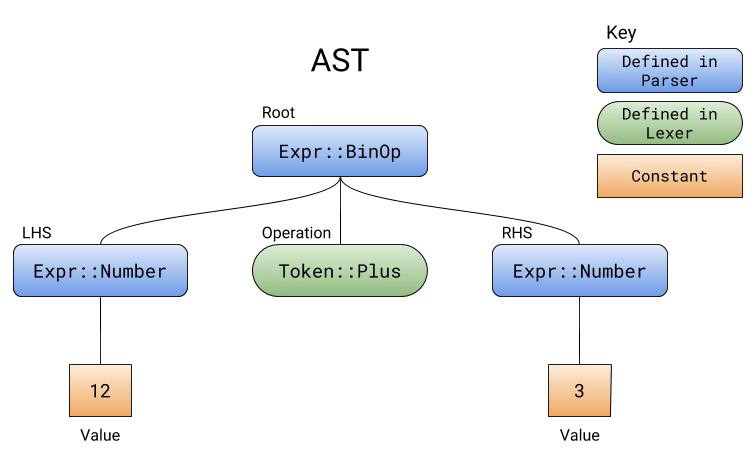
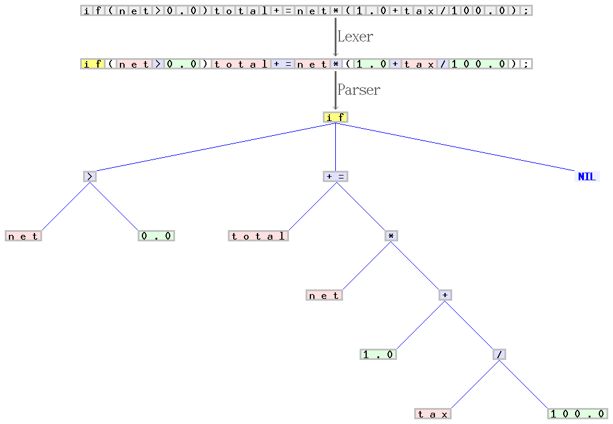
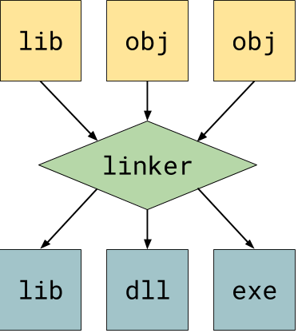

本文为翻译作品 [点击原文](https://towardsdatascience.com/understanding-compilers-for-humans-version-2-157f0edb02dd)

理解编译器的内部运作原理可以让你更高效地使用它。在接下来的一系列文章中，我将使用包含大量引用链接、示例代码和图示的组合来帮助你理解编程语言和编译器是如何工作的。

- - -

作者笔记  
[理解编译器 - 人类视角(Version 2)](https://blog.leble.ink/understanding-compilers-for-humans-version-2/) 是我在Medium发布的第二篇文章的后续更新，这篇文章有超过2万多浏览量，我非常高兴能够在传授知识上做出一点微小积极的贡献，我也非常兴奋能够基于那篇文章的评论带来完全重构的新文章。


我选择 Rust 作为这个系列文章的主要语言。它是一门详细、高效、现代的，并且在设计上似乎对制作编写器非常简单。我喜欢用它。[https://www.rust-lang.org/](https://www.rust-lang.org/)


这篇文章的目的是引起读者关于编译器的兴趣，而不是超过20页的长篇累牍。这篇文章中有许多链接可以指导您更深入地了解引起您兴趣的主题。大多数链接都指向维基百科。

请随时在底部的评论部分留下任何问题或建议。感谢您的关注，我希望您喜欢。

- - -

## 介绍
### 什么是编译器

**一般来说，你可以称之为编程语言的只是软件，称为编译器，它读取文本文件，对其进行大量处理并生成二进制文件。**由于计算机只能读取1和0，并且人类编写的Rust比二进制文件更好，因此编译器会将人类可读的文本转换为计算机可读的机器代码。
```rust
// An example compiler that turns 0s into 1s, and 1s into 0s.
 
fn main() {
    let input = "1 0 1 A 1 0 1 3";
    
    // iterate over every character `c` in input
    let output: String = input.chars().map(|c|
        if c == '1' { '0' }
        else if c == '0' { '1' }
        else { c } // if not 0 or 1, leave it alone
    ).collect();
    
    println!("{}", output); // 0 1 0 A 0 1 0 3
}
```
*虽然上面这个编译器不读取文件，不生成AST，也不生成二进制文件，但它仍然被认为是编译器，原因很简单，它转换了一个输入输出。*

### 编译器的工作流程

简单来说，编译器读取源代码并生成二进制文件。人类可读的代码直接转换为0和1是非常复杂的，从主要的来讲，编译器在程序可运行之前有几个处理步骤：
1. 读取您提供的源代码的各个字符。
2. 将字符排序为单词，数字，符号和运算符。
3. 获取已排序的字符并通过将它们与模式匹配并创建操作树来确定它们尝试执行的操作。
4. 迭代在最后一步中生成的树中的每个操作，并生成等效的二进制文件。

*虽然我说编译器立即从一个操作树转到二进制，但它实际上是生成汇编代码，然后汇编/编译成二进制代码。汇编就像一个更高级别，人类可读的二进制文件。详细了解[点击这里](https://en.wikipedia.org/wiki/Assembly_language)。*


### 什么是解释器
[解释器(Interpreter)](https://en.wikipedia.org/wiki/Interpreter_%28computing%29) 很像编译器，因为他们读取一种语言并对其进行处理。但是，**解释器会跳过代码生成并执行[即时编译(JIT)](https://en.wikipedia.org/wiki/Just-in-time_compilation)AST。**解释器的最大优点是在调试期间开始运行程序所需的时间可以变得很小。编译器可能需要花费几秒到几分钟的时间来在执行编译阶段，而解释器可以立即开始执行，而不进行编译。解释器的最大缺点是它需要在执行程序之前安装在用户的计算机上。


本文主要涉及的是编译器，但也应明确它们之间的差异以及编译器之间的关系，对比上面两图可以看见解释器缺少最后一个步骤：生成二进制执行文件，而直接执行程序。

下面我们来看看编译器的每个阶段


## 1. 词法分析(Lexical Analysis)

第一步是按字符分割输入字符。此步骤称为[词法分析(lexical analysis)](https://en.wikipedia.org/wiki/Lexical_analysis)或标记化(tokenization)。主要思想是**将字符组合在一起以形成我们需要的的单词，标识符，符号等。** 词法分析大部分时候不涉及解决例如 `2 + 2` 这样的任何计算逻辑，它只会说我们得到了三个标记：一个数字：`2`、一个加号(`+`)、然后是另一个数字：`2`。

假设你正在分析一个像 `12 + 3` 这样的字符串：它会读取字符`1`，`2`，`+`和`3`。我们有不同的字符，但我们必须将它们组合在一起，这是词法解释器(tokenizer)的主要任务之一。例如，我们将`1`和`2`作为单个字母，但我们需要将它们放在一起并将它们解析为单个整数。`+`也需要被识别为加号，而不是其文字字符值-[ASCII码](http://www.asciitable.com/)`43`。


如果您可以查看下面链接代码则能帮助理解更具意义，代码中Rust tokenizer可以将数字分组为32位整数，并将加号作为枚举类型`Token`的值`Plus`。  
点击查看->[Rust tokenizer](https://play.rust-lang.org/?gist=070c3b6b985098a306c62881d7f2f82c&version=stable&mode=debug&edition=2015)  
*您可以单击Rust Playground左上角的“运行”按钮，在浏览器中编译并执行代码。*
附代码: 
```rust
#[derive(Debug)]
enum Token {
    Number(i32),
    Plus,
}

fn tokenize(input: &str) -> Vec<Token> {
    let mut tokens: Vec<Token> = Vec::new();
    let chars = input.chars().collect::<Vec<char>>();

    let mut i: usize = 0;
    while i < chars.len() {
        match chars[i] {
            '+' => tokens.push(Token::Plus),
            c => {
                if c.is_digit(10) {
                    // if c is a digit in base 10
                    let mut number_string: String = c.to_string();
                    i += 1; // consume c

                    while i < chars.len() && chars[i].is_digit(10) {
                        number_string.push(chars[i]);
                        i += 1;
                    }

                    let number: i32 = number_string.parse().expect("invalid number");
                    tokens.push(Token::Number(number));

                    // Since we `i += 1` at end of the last loop, we have to skip over
                    // the following i += 1 at the end of the current while loop.
                    continue;
                }
            }
        }
        i += 1;
    }

    tokens
}

fn main() {
    let input = "12+3";
    println!("input: {:?}", input); // Print literal value of `input`
    println!("{:?}", tokenize(input)); // Print tokenized `input`
}
```
在编程语言的编译器中，词法分析器可能需要具有几种不同类型的token。例如：符号(symbols)，数字(numbers)，标识符(identifiers)，字符串(strings)，运算符(operators)，等等。它完全依赖于语言本身来了解您需要从源代码中提取哪种类型的token。  


```c
int main() {
    int a;
    int b;
    a = b = 4;
    return a - b;
}

Scanner production:
[Keyword(Int), Id("main"), Symbol(LParen), Symbol(RParen), Symbol(LBrace), Keyword(Int), Id("a"), Symbol(Semicolon), Keyword(Int), Id("b"), Symbol(Semicolon), Id("a"), Operator(Assignment), Id("b"),
Operator(Assignment), Integer(4), Symbol(Semicolon), Keyword(Return), Id("a"), Operator(Minus), Id("b"), Symbol(Semicolon), Symbol(RBrace)]
```
*已经过词法分析的C源代码示例，其代码已打印出来。*

## 2. 解析(Parsing)
解析器是语法的真正核心。**解析器获取词法分析器生成的标记，尝试查看它们是否处于某些模式，然后将这些模式与调用函数，调用变量或数学运算等表达式相关联。** 解析器从字面上定义了语言的语法。

代码`int a = 3`和`a：int = 3`之间的区别在于解析器。解析器决定了语法是什么样的。它确保括号和花括号平衡，每个语句以分号结束，并且每个函数都有一个名称。当标记(tokens)不符合预期模式时，解析器知道事情的顺序不正确。

*解析器有多种[类型](https://en.wikipedia.org/wiki/Parsing#Types_of_parsers)。其中最常见的是自上而下的[递归下降解析器](https://en.wikipedia.org/wiki/Recursive_descent_parser)。递归下降解析是其中最简单的使用和理解的。我创建的所有解析器示例都是基于递归下降的。*

解析器解析的语法可以用[形式文法](https://en.wikipedia.org/wiki/Formal_grammar)概述。像EBNF这样的文法可以描述一个解析器，用于简单的数学运算，如`12 + 3`：
```ebnf
expr = additive_expr ;
additive_expr = term, ('+' | '-'), term ;
term = number ;
```
*简单加减法表达式的EBNF文法。*

*请记住，语法文件不是解析器，而是解析器的功能概述。你就像这样的语法来构建一个解析器。它是供人类阅读使用的，并且比直接查看解析器的代码更容易阅读和理解。*

该语法的解析器是`expr`解析器，因为它是基本上与所有内容相关的顶级项。唯一有效的输入必须是任何数字，加号或减号，任何数字。 `expr`期望一个`additive_expr`，这是主要的加法和减法出现的地方。`additive_expr`首先期望一个`term`（一个数字），然后加或减，然后另一个`term`。

**解析器在解析时生成的树称为[抽象语法树](https://en.wikipedia.org/wiki/Abstract_syntax_tree)或AST。** AST包含了所有操作。解析器不计算操作，只是按正确的顺序收集AST。

*生成用于解析12 + 3的示例AST。*

我在之前写的词法分析器代码基础上添加了语法分析器，以便它匹配我们的语法，并且可以像图一样生成AST。我用注释``// BEGIN PARSER //``和``// END PARSER //``标记了新解析器代码的开头和结尾。  
点击查看->[Rust Parser](https://play.rust-lang.org/?gist=205deadb23dbc814912185cec8148fcf&version=stable&mode=debug&edition=2015)

我们实际上可以走得更远。假设我们想要支持只是没有操作的数字的输入，或者添加乘法和除法，甚至添加优先级。可以快速更改语法文件，并进行调整以将其反映在我们的解析器代码中。
```ebnf
expr = additive_expr ;
additive_expr = multiplicative_expr, { ('+' | '-'), multiplicative_expr } ;
multiplicative_expr = term, { ("*" | "/"), term } ;
term = number ;
```
点击查看->[Rust Parser2](https://play.rust-lang.org/?gist=1587a5dd6109f70cafe68818a8c1a883&version=nightly&mode=debug&edition=2018)

  
*扫描程序（a.k.a. lexer）和C的解析器示例从字符序列开始“`if（net> 0.0）total + = net *（1.0 + tax / 100.0）;`”,扫描仪对其组成一系列tokens，并对它们中的每一个进行分类，例如，作为标识符，保留字，数字文字或运算符。然后处理后一个序列由解析器转换为语法树。扫描器和解析器分别处理C语法的规则和正确上下文无关文法部分。Credit: Jochen Burghardt. [Original](https://commons.wikimedia.org/wiki/File:Xxx_Scanner_and_parser_example_for_C.gif).*

## 3. 生成代码 (Generating Code)

[代码生成器](https://en.wikipedia.org/wiki/Code_generation_%28compiler%29)接受 AST 并生成等效代码或汇编代码。**代码生成器必须以递归下降顺序遍历AST中的每个项目，就像解析器的工作方式一样 ，然后生成等效代码。**

[Compliler Explorer](https://godbolt.org/z/K8416_)  
如果打开上面的链接，则可以看到左侧示例代码生成的汇编程序集。汇编代码的第3行和第4行显示了编译器在AST中遇到常量时如何为常量生成代码。

*Godbolt Compiler Explorer是一款出色的工具，允许您使用高级编程语言编写代码并查看其生成的汇编代码。你可以尝试在里面编辑，看看最后生成什么样的代码，但不要忘记将优化标志添加到您的语言编译器中，以查看它有多智能。（-O for Rust）*

如果您对编译器如何将本地变量保存到ASM中的内存感兴趣，[这篇文章](https://norasandler.com/2018/01/08/Write-a-Compiler-5.html)（“代码生成”一节）详细解释了堆栈。大多数情况下，当变量不是本地变量时，高级编译器为变量在堆上分配内存并存储，而不是存储在堆栈中。您可以在此[StackOverflow答案](https://stackoverflow.com/a/18446414)中阅读有关存储变量的更多信息。

由于汇编是一个完全不同的，复杂的主题，我不会特别谈论它。我只想强调代码生成器的重要性和工作。此外，代码生成器不仅可以生成组件。 [Haxe](https://haxe.org/)编译器有一个后端，可以生成六种不同的编程语言:包括`C++`，`Java`和`Python`。

*后端是指编译器的代码生成器或赋值器，因此，前端是词法分析器和解析器。还有一个中间端，主要与本节后面解释的优化和IR工作有关。后端与前端大多无关，只关心它收到的AST。这意味着可以为几个不同的前端或语言重用相同的后端。有个非常出名的[GNU编译器集合](https://gcc.gnu.org/)(GNU Compiler Collection/GCC)，就是这种情况。*

*我没有比 C 编译器后端更好的代码生成器示例，你可以在[这个链接](https://github.com/asmoaesl/ox/blob/master/src/generator.rs)找到它。*

生成汇编后，它将被写入新的汇编文件（.s或.asm）。然后，该文件将通过汇编程序传递，汇编程序是汇编程序的编译器，并生成等效二进制文件。然后将二进制代码写入称为目标文件（.o）的新文件。

**对象文件是机器代码，但现在它们还不可执行。**要使它们成为可执行文件，需要将目标文件链接在一起。链接器处理这个通用机器代码并使其成为可执行文件、[共享库](https://en.wikipedia.org/wiki/Library_%28computing%29#Shared_libraries)或是[静态库](https://en.wikipedia.org/wiki/Library_%28computing%29#Static_libraries)。更多关于链接器的信息请点击[这里](https://en.wikipedia.org/wiki/Linker_%28computing%29#Overview)。

链接器(Linkers)是基于操作系统而不同的工具程序。单个第三方链接器应该能够编译后端生成的目标代码。在编译时，不需要创建自己的链接器。



编译器可以具有[中间表示(intermediate representation)](https://en.wikipedia.org/wiki/Intermediate_representation)或IR。 **IR旨在无损地表示原始指令以进行优化或翻译成另一种语言。**IR不是原始源代码,为了在代码中找到潜在的优化，IR是无损的简化。[循环展开优化](https://en.wikipedia.org/wiki/Loop_unrolling)和[矢量化](https://en.wikipedia.org/wiki/Automatic_vectorization)就是在IR过程中处理的。有关IR相关优化的更多示例可在这个[PDF](http://www.keithschwarz.com/cs143/WWW/sum2011/lectures/140_IR_Optimization.pdf)中找到。


## 结论 (Conclusion)

了解编译器之后，您可以更有效地使用编程语言。也许有一天你会对编写自己的编程语言感兴趣？我希望这篇文章能帮助到你。

## 资源与进一步阅读 (Resources & Further Reading)

* http://craftinginterpreters.com/ - 指导您使用C和Java制作解释器。
* https://norasandler.com/2017/11/29/Write-a-Compiler.html - 对我来说可能是最有益的“编写编译器”教程。
* 我的C编译器和科学计算器解析器可以在[这里](https://github.com/asmoaesl/ox)和[这里](https://github.com/asmoaesl/rsc)找到。
* 可以在[此处](https://play.rust-lang.org/?gist=d9db7cfad2bb3efb0a635cddcc513839&version=stable&mode=debug&edition=2015)找到另一种类型的解析器的示例，称为优先上升解析器。来源：韦斯利诺里斯(Wesley Norris)
